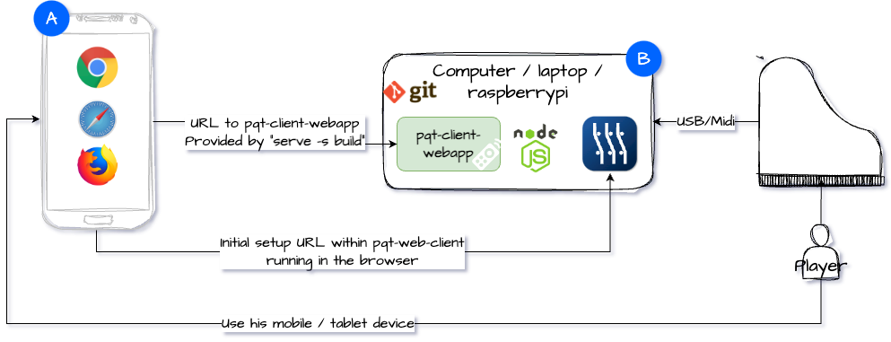

# Pianoteq client 

This project allows you to control your Pianoteq instance from any browser (Safari, Chrome and Firefox).

Here are the main features

*  Media player (Midi)
*  Piano controls
    * Volume and dynamics controls
    * Sound modes (Recording, binaural, stereo & mono)
    * Piano condition
    * Piano lid 
*  Voicing controls
    * Hammer settings
    * Pedal settings
*  Effects controls
    * Post effect gain
    * EQ 1 & 2
    * Delay and reverb
    * Note effects (As of version 8)
*  Design controls
    * Soundboard settings
    * String settings
    * Blooming settings
*  Loading an instrument
    * Previous and next preset
    * Reload a preset (Useful, when you make changes to Pianoteq directly)
*  Saving a modified preset
*  A/B Switching
*  Metronome

### Some screenshots

  

# How to use it
You have two options 

1. Make use of the public website (Easiest)
2. Or Install the web application locally onto the same computer as your running instance of Pianoteq [Section for option 2](#option-2---deploy-localy)

## Option 1 - Public website 
Simply click on the link below!  This option does not require any install, other than having a running instance of Pianoteq on a computer.

* http://ptq-web-client.s3-website-us-east-1.amazonaws.com

Once the page opens, you'll need to set the URL of the running instance of Pianoteq, using the menu.

> **Note** - This public site will probably be brought down in the future as browsers are starting to implement a new security feature that forbids public sites to make local network calls. This is a great addition for a safer browsing experience, but will negatively impact the public site for ptq-client-webapp. For now, as of this writing, the following browsers are supported with the public site: **Safari** and **Firefox**.

### Option 1 - Step 1: Running Pianoteq to enable JSONRPC
Before you can perform the initial setup, you need to make sure that you have enable JSONRPC when launching Pianoteq.  Here is some example on how to do it below.

* On Mac - `open /Applications/Pianoteq\ 8/Pianoteq\ 8.app --args --serve ip.address.of.device:8081`
* On PC - `C:\Program Files\Modartt\Pianoteq 8>"Pianoteq 8.exe" --serve ip.address.of.device:8081`

> **Note** You need to replace the `ip.address.of.device` with the ip address of your device.  We need to specify the ip address, otherwise it will cause CORS issues with the application.  If you want a different port, simply change it on the command line to launch Pianoteq.

### Option 1 - Step 2: Initial setup of the app
First launch the PTQ-client-webapp by clicking on the link 

* http://ptq-web-client.s3-website-us-east-1.amazonaws.com

In the top left corner, click on the menu. This will bring the Main menu up where you'll find the parameters to `Pianoteq full API address`. See image below

Enter the URL of your running Pianoteq instance in the `Pianoteq full API address` field and then click on the right blue arrow. That's it, you are all set. Happy playing!

> **Note** - You need to click on the right blue arrow for the change to take effect, otherwise the provided value will be ignored.

### Option 1 - Step 3: Install a shortcut on your mobile device (Optional)
Yes, you may install a shortcut of this web application on your home screen.  Bear in mind that is just a shortcut being installed.  This shortcut still references the URL it came from.

* iOS Safari
    * Click on the link above to load the web app
    * Click on the share button
    * And select the `Add to home screen` menu.  That's it!
* Android Chrome
    * Click on the link above to load the web app
    * Click on the 3 dots
    * And select `Add to home screen`

> **Note** - This will run the web application offline, i.e. it will not load the app from the web at every launch (This behavior varies from devices).  To force a reload from the web, you'll need to force quit the app.

# Option 2 - Deploy localy
This option is only required if you do not want to make use of the public site (option 1) and want to host this application localy on your network.  This is required if you want to use Chrome on your mobile device.

The diagram below depict where you should be performing the install.  We expect all the required software to be install on the same computer that Pianoteq is running.  This is where the PTQ-WEB-CLIENT will be hosted.

[A]: Mobile device with your prefered browser.  This will be use to access PTQ-Client-Webapp

[B]: Computer where Pianoteq is running and where we expect you to install all the required softwares

Here are the overall steps required for this option to work.  All these steps must be performed on the same computer as the running instance of Pianoteq

1. Step 1 - Have a running instance of Pianoteq with JSONRPC enabled
2. Step 2 - Install node on the same computer as Pianoteq
3. Step 3 - Insall this project Ptq-Client-Webapp on the same computer as Pianoteq
4. Step 4 - Run the HTTP server to serve Ptq-Client-Webapp to your local network
5. Step 5 - Access the Ptq-Client-Webapp from your mobile device

### Option 2 - Step 1: Running Pianoteq to enable JSONRPC
For our application to work, you need to make sure that you have enable JSONRPC when launching Pianoteq.  Here is some example on how to do it below.

* On Mac - `open /Applications/Pianoteq\ 8/Pianoteq\ 8.app --args --serve ip.address.of.device:8081`
* On PC - `C:\Program Files\Modartt\Pianoteq 8>"Pianoteq 8.exe" --serve ip.address.of.device:8081`

> **Note** You need to replace the `ip.address.of.device` with the ip address of your device.  We need to specify the ip address, otherwise it will cause CORS issues with the application.  If you want a different port, simply change it on the command line to launch Pianoteq.

### Option 2 - Step 2: Install node
You need to make sure that you have node installed on your computer where Pianoteq is running.  Below expalin how to install it on your prefered computer

#### How to install node on Mac / Windows
Visit the node webpage [here](https://nodejs.dev) 

#### How to install node on Raspberry PI
Visit the [git repo](https://github.com/nodesource/distributions) of nodesource for the latest release, but as of this writing, you may use the following command for version 16.x

    # From the terminal
    curl -fsSL https://deb.nodesource.com/setup_16.x | sudo -E bash -
    sudo apt-get install -y nodejs

### Option 2 - Step 3 - Install PQT-Client-Webapp
You need to install this on the same computer of the running instance of Pianoteq

#### First install
In the folder of your choice, launch the following command from a terminal window. In a folder of your choice perform the following:

    git clone https://github.com/robert-rc2i/ptq-client-webapp.git
    cd ptq-client-webapp
    npm install

This will create a new folder named `ptq-client-webapp` and will install all required dependencies of this project.  

#### Upgrade to the latest version
> **Note** This is only necessary when there is a new version of the app.

For this, you simply launch the following commands in the project root folder

     git pull origin main
     npm install

This will replace your current project with the latest changes from the git repo and install any new dependencies that the project may have added

### Option 2 - Step 4: Running the app (PQT-Client-Webapp)
This step will make PQT-Client-Webapp available to any mobile device on your network. From the project root directory type the following commands:
    
    npm run build
    npx serve -s build

This will launch a small HTTP server and serve the newly built project at the directory named `build`.  You should see an output like so:

    ┌──────────────────────────────────────────────────┐
    │                                                  │
    │   Serving!                                       │
    │                                                  │
    │   - Local:            http://localhost:3000      │
    │   - On Your Network:  http://192.168.2.59:3000   │
    │                                                  │
    │   Copied local address to clipboard!             │
    │                                                  │
    └──────────────────────────────────────────────────┘

### Option 2 - Step 5: Access the PQT-Client-Webapp from your mobile device
Open a browser on your phone/tablet and enter the URL that was provided in the Step 4.

That's it!  You should now see the application on your mobile device.

## Final note
I am not affiliated with Modartt.  All references to Modartt are governed by their trademark and licenses.

Hope it helps in your Pianoteq setup and happy playing!
