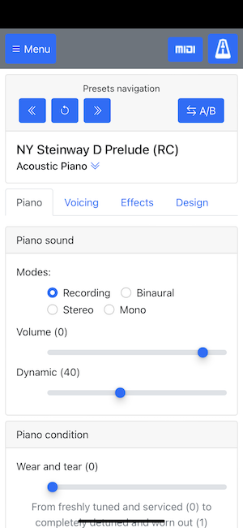
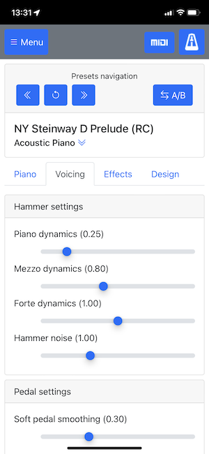
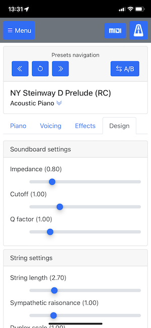
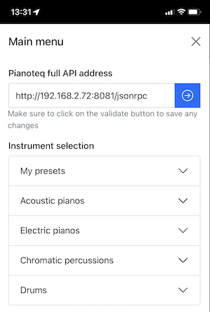
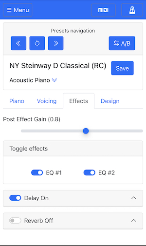
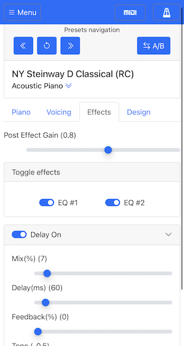
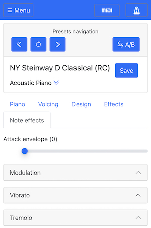

# Pianoteq client 

This project allows you to control your Pianoteq instance from any browser (Safari, Chrome and Firefox).

Here are the main features

*  Media player (Midi)
*  Piano controls
    * Volume and dynamics controls
    * Sound modes (Recording, binaural, stereo & mono)
    * Piano condition
    * Piano lid 
*  Voicing controls
    * Hammer settings
    * Pedal settings
*  Effects controls
    * Post effect gain
    * EQ 1 & 2
    * Delay and reverb
    * Note effects (As of version 8)
*  Design controls
    * Soundboard settings
    * String settings
    * Blooming settings
*  Loading an instrument
    * Previous and next preset
    * Reload a preset (Useful, when you make changes to Pianoteq directly)
*  Saving a modified preset
*  A/B Switching
*  Metronome

### Some screenshots

   
  
 

# How to use it
Simply click on the link below!  

* http://ptq-web-client.s3-website-us-east-1.amazonaws.com

Once the page opens, you'll need to set the URL of the running instance of Pianoteq, using the menu.

> **Note** - This public site will probably be brought down in the future as browsers are starting to implement a new security feature that forbids public sites to make local network calls. This is a great addition for a safer browsing experience, but will negatively impact the public site for ptq-client-webapp. For now, as of this writing, the following browsers are supported with the public site: **Safari** and **Firefox**.

## Initial setup of the app
In the top left corner, click on the menu. This will bring the Main menu up where you'll find the parameters to `Pianoteq full API address`. See image below

Enter the URL of your running Pianoteq instance in the `Pianoteq full API address` field and then click on the right blue arrow. That's it, you are all set. Happy playing!

> **Note** - You need to click on the right blue arrow for the change to take effect, otherwise the provided value will be ignored.

## Install on your mobile device
Yes, you may install this web application on your home screen.  Your mobile device will treat it as if it was a native application.

* iOS Safari
    * Click on the link above to load the web app
    * Click on the share button
    * And select the `Add to home screen` menu.  That's it!
* Android Chrome
    * Click on the link above to load the web app
    * Click on the 3 dots
    * And select `Add to home screen`

> **Note** - This will run the web application offline, i.e. it will not load the app from the web anymore (This behavior varies from devices).  To force a reload from the web, you'll need to force quit the app.  Useful, when a new version is available.

# Deploy localy
This step is required only if you want to host this application localy on your network.

## Requirements
Before you can deploy this project locally, you need to first install the required software.

* Git (Optional) - Usually git is installed by default on most operating systems
* Node - Node has to be installed on your computer for this to work, as I make use of it to start the single page application.
* Pianoteq running on a reachable device

### Running Pianoteq from the command line

* On Mac - `open /Applications/Pianoteq\ 8/Pianoteq\ 8.app --args --serve ip.address.of.device:8081`
* On PC - `C:\Program Files\Modartt\Pianoteq 8>"Pianoteq 8.exe" --serve ip.address.of.device:8081`

> **Note** You need to replace the `ip.address.of.device` with the ip address of your device.  We need to specify the ip address, otherwise it will cause CORS issues with the application.  If you want a different port, simply change it on the command line to launch Pianoteq.

### How to install node on Mac / Windows
Visit the node webpage [here](https://nodejs.dev) 

### How to install node on Raspberry PI
Visit the [git repo](https://github.com/nodesource/distributions) of nodesource for the latest release, but as of this writing, you may use the following command for version 16.x

    # From the terminal
    curl -fsSL https://deb.nodesource.com/setup_16.x | sudo -E bash -
    sudo apt-get install -y nodejs

## How to install this project
This is only necessary if you want to host the web app locally and not make use of the provided link above.

### First install
In the folder of your choice, launch the following command from a terminal window.

    git clone https://github.com/robert-rc2i/ptq-client-webapp.git
    cd ptq-client-webapp
    npm install

This will create a new folder named `ptq-client-webapp` and will install all required dependencies of this project.  

### Upgrade to the latest version
> **Note** This is only necessary when there is a new version of the app.

For this, you simply launch the following commands in the project root folder

     git pull origin main
     npm install

This will replace your current project with the latest changes from the git repo and install any new dependencies that the project may have added

## How to serve the web app
You can serve the built project by using `serve` module.  From the project root directory type the following commands:
    
    npm run build
    npx serve -s build

This will launch a small HTTP server and serve the newly built project at the directory named `build`.  You should see an output like so:

    ┌──────────────────────────────────────────────────┐
    │                                                  │
    │   Serving!                                       │
    │                                                  │
    │   - Local:            http://localhost:3000      │
    │   - On Your Network:  http://192.168.2.59:3000   │
    │                                                  │
    │   Copied local address to clipboard!             │
    │                                                  │
    └──────────────────────────────────────────────────┘

## Final note
I am not affiliated with Modartt.  All references to Modartt are governed by their trademark and licenses.

Hope it helps in your Pianoteq setup and happy playing!
